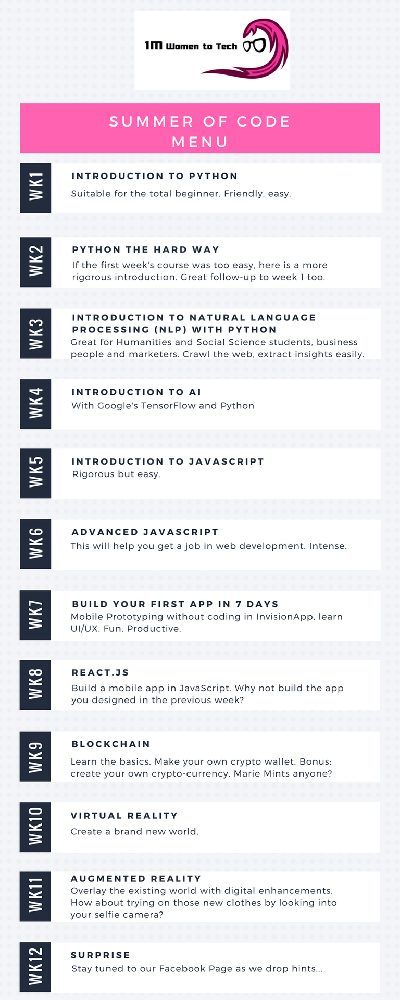

# 1MWTT - Summer of Code 2018

# Introduction

[One Million Women to Tech – women’s Summer of Code 2018](https://1millionwomentotech.com/summerofcode1/) is a 3-month global program focused on bringing more females into software development. Women can take free online coding courses and work in teams on programming challenges in weekly and monthly hackathons. 

# About

This repository contain additional materials(resources) for my students during Summer of Code based from [toolkitten](https://github.com/1millionwomentotech/toolkitten). Each of my student is encourage to fork this repository and committing to their own fork.

# Prerequisites

As student or learner, this is what you need to know before you get started with the exercises:

 * computer(PC/laptop)
 * internet connection
 * ability to learn on your own
No coding knowledge is presumed for the beginner courses.

For the hackathons you need to know the basics of Git and GitHub:

 * fork
 * merge
 * pull requests

# Courses

## Syllabus

### Week 1

July 16 - 20    Introduction to Python

Using [Learn to Program](https://pine.fm/LearnToProgram/) for Python.

1. Getting Started: Installing Python on Windows, Mac
2. Numbers
3. Letters
4. Variables and Assignment
5. Mixing It Up
6. More About Functions and Methods
7. Flow Control
8. Arrays and Iterators
9. Writing Your Own Functions 
10. Classes
11. There is nothing new in the chapter (recursion)
12. Beyond This Tutorial

### Week 2

July 23 - 27 Advanced Python

Using [Python the Hard Way](https://learnpythonthehardway.org/book/) we will go as far as possible in a week.

- Exercise 0: The Setup
- Exercise 1: A Good First Program
- Exercise 2: Comments And Pound Characters
- Exercise 3: Numbers And Math
- Exercise 4: Variables And Names
- Exercise 5: More Variables And Printing
- Exercise 6: Strings And Text
- Exercise 7: More Printing
- Exercise 8: Printing, Printing
- Exercise 9: Printing, Printing, Printing
- Exercise 10: What Was That?
- Exercise 11: Asking Questions
- Exercise 12: Prompting People
- Exercise 13: Parameters, Unpacking, Variables
- Exercise 14: Prompting And Passing
- Exercise 15: Reading Files
- Exercise 16: Reading And Writing Files
- Exercise 17: More Files
- Exercise 18: Names, Variables, Code, Functions
- Exercise 19: Functions And Variables
- Exercise 20: Functions And Files
- Exercise 21: Functions Can Return Something
- Exercise 22: What Do You Know So Far?
- Exercise 23: Read Some Code
- Exercise 24: More Practice
- Exercise 25: Even More Practice
- Exercise 26: Congratulations, Take A Test!
- Exercise 27: Memorizing Logic
- Exercise 28: Boolean Practice
- Exercise 29: What If
- Exercise 30: Else And If
- Exercise 31: Making Decisions
- Exercise 32: Loops And Lists
- Exercise 33: While Loops
- Exercise 34: Accessing Elements Of Lists
- Exercise 35: Branches and Functions
- Exercise 36: Designing and Debugging
- Exercise 37: Symbol Review
- Exercise 38: Doing Things To Lists
- Exercise 39: Dictionaries, Oh Lovely Dictionaries
- Exercise 40: Modules, Classes, And Objects
- Exercise 41: Learning To Speak Object Oriented
- Exercise 42: Is-A, Has-A, Objects, and Classes
- Exercise 43: Gothons From Planet Percal #25
- Exercise 44: Inheritance Vs. Composition
- Exercise 45: You Make A Game
- Exercise 46: A Project Skeleton
- Exercise 47: Automated Testing
- Exercise 48: Advanced User Input
- Exercise 49: Making Sentences
- Exercise 50: Your First Website
- Exercise 51: Getting Input From A Browser
- Exercise 52: The Start Of Your Web Game

### Week 3

July 30 - August 3  Natural Language Processing with Python

Using the [NLTK book](http://www.nltk.org/book/) probably only covering chapters 0-4 during the week.

0. Preface
1. Language Processing and Python
2. Accessing Text Corpora and Lexical Resources
3. Processing Raw Text
4. Writing Structured Programs
5. Categorizing and Tagging Words
6. Learning to Classify Text
7. Extracting Information from Text
8. Analyzing Sentence Structure
9. Building Feature Based Grammars
10. Analyzing the Meaning of Sentences
11. Managing Linguistic Data
12. Afterword: Facing the Language Challenge

### Week 4

August 6 - 10 Artificial Intelligence with Python & Tensorflow

Using [Machine Learning Crash Course](https://developers.google.com/machine-learning/crash-course/prereqs-and-prework) from Google.

### Week 5

August 13 - 17 Introductory JavaScript

We will repeat [Learn to Program](https://pine.fm/LearnToProgram/) this time for JavaScript. 

1. Getting Started: Installing Python on Windows, Mac
2. Numbers
3. Letters
4. Variables and Assignment
5. Mixing It Up
6. More About Functions and Methods
7. Flow Control
8. Arrays and Iterators
9. Writing Your Own Functions 
10. Classes
11. There is nothing new in the chapter (recursion)
12. Beyond This Tutorial

Additionally Chapters 1-7 from [Professional JavaScript™ for Web Developers](https://github.com/tain335/tain335/blob/master/books/javascript/Professional%20JavaScript%20for%20Web%20Developers%203rd%20Edition.pdf).

1. What is JavaScript
2. JavaScript in HTML
3. Language Basics
4. Variables, Scope and Memory
5. Reference Types
6. Object-Oriented Programming
7. Function Expressions

### Week 6

August 20 - 24 Advanced JavaScript

Using the [Advanced JavaScript](https://github.com/advanced-js/syllabus#course-outline) open courseware from NYW.

### Week 7

August 27 - 31    Mobile Prototyping (UI/UX) in InvisionApp

Using Invision's [Getting Started](https://github.com/advanced-js/syllabus#course-outline) guides.

 1. Introduction to InvisionApp
 2. Boards
 3. Building Projects
 4. Working Together
 5. Feedback and Development

### Week 8

September 3 - 7 Mobile App Development with React.JS

Using the Facebook React.JS [tutorial](https://reactjs.org/tutorial/tutorial.html) and [Learning JavaScript Design Patters](https://addyosmani.com/resources/essentialjsdesignpatterns/book/)

### Week 9

September 10 - 14 Blockchain

Tentative: Using Oxford BlocSoc's intro to Blockchain course

Alternative is a Solidity intro course
- https://solidity.readthedocs.io/en/v0.4.24/
- https://codeburst.io/build-your-first-ethereum-smart-contract-with-solidity-tutorial-94171d6b1c4b

### Week 10

September 17 - 21 Virtual Reality

Using Facebook [VR stack](https://developers.facebook.com/products#virtual-reality)

- 3D Posts
Create immersive 3D posts and content for the Facebook News Feed.

- Facebook 360
Create and share immersive stories, places and experiences.

- Oculus
Create compelling VR experiences and reach passionate VR audiences.

- Quill
A VR illustration and animation tool built to help empower artists and creators.

- React 360
Use web tech to create content for audiences across mobile, web and VR.

### Week 11

September 24 - 28 Augmented Reality

Visual programming in Facebook [AR Studio](https://developers.facebook.com/docs/ar-studio) this is Mac only. We need a Windows alternative until AR Studio comes out for Windows. 

### Week 12

October 1 - 5 TBD (best suited for senior developers with a broad skill set)

- An introduction to collaboration using Github.
- Community engagement course.

# Hackathons

Hacking is creative problem solving. (It does not have to involve technology.)
A hackathon is any event of any duration where people come together to solve problems. Most hackathons I’ve run also have a parallel track for workshops.
Participants typically form groups of about 2-6 individuals, take out their laptops (if the event is technology themed), and dive into problems. Training workshops are a great parallel track especially for newcomers but also for all participants.

## Positive energy

Hackathons have gotten a bad rap because of some that have an unhealthy, competitive structure, and for setting unrealistic expectations. Don’t participate in hackathon with that mindset and you’ll be on the right track. Here are the goals to keep in mind:

## Strengthen the community that the hackathon is for.

Be welcoming to newcomers to the community.
Provide an opportunity for participants to learn something new.
Provide a space and a time for participants to make headway on problems they are interested in.
Don’t expect to have actually solved a problem by the end of the hackathon. Real life problems are hard! Think of the hackathon as a pit-stop on a long journey to solve problems or as a training session to prepare participants for solving problems.

Since you’re not going to solve a problem, don’t put unrealistic (and unhealthy) pressure on your participants. Don’t stay up all night, don’t pump yourself with caffeine, and don’t make winners and losers. Just don’t. Participants should come energized and be greeted with positive energy.

## Welcoming newcomers

The hardest thing about running a successful hackathon is being welcoming to newcomers and helping them get involved in an activity.

Newcomers often suffer from “imposter syndrome”, the feeling that they don’t belong because they don’t have skills, aren’t smart enough, etc. They’re wrong, of course, but until they feel like they belong they will not be able to have a fulfilling experience. It is the hackathon organizers', the mentors' and the more experienced participants' job to help them realize they have something to contribute.

First time hackathon participants are often overwhelmed when it comes time to finding a project to work on. They may not yet know how to relate their own skills to the sorts of projects being worked on. Knowing how to be useful is a skill in itself. You will need to guide them to a project and through a process for them to realize how they can contribute. If you have too many lost participants and not enough help in getting them started on a project, they will leave — let's try to avoid that.

## Hackhaton Schedule

Throughout the Summer of Code there are 12 weekly hackathons, 3 monthly hackathons, and 1 all-summer hackathon. Participants may enter one or more.

The weekly hackathons follow the theme of the week's course module so Week 1 is "Introduction to Python", and the hackathon is for entry level Python hacks, and so on.

The monthly hackathon's follow the tracks so Month 1 hackathon is for Python hacks, Month 2 for JavaScript hacks, and Month 3 for all the AR, VR, and Blockchain hacks.

The all-summer hackathon is an open category so that those who have a project in mind can use the Summer of Code as an opportunity to develop their idea into a prototype or even an MVP and have a chance to showcase it.

|Name | Type | Dates | Theme | Project Ideas|
|---|--- | --- | --- | ---|
|Week 1| Themed |July 14 - 20 | Introduction to Python||
|Week 2| Themed |July 21 - 27 | Python the Hard Way||
|Week 3| Themed |July 28 - August 3 | Natural Language Processing with Python||
|Week 4| Themed |August 4 - 10 |Artificial Intelligence with Python & Tensorflow||
|Week 5| Themed |August 11 - 17 | Introductory JavaScript||
|Week 6| Themed |August 18 - 24  |Advanced JavaScript||
|Week 7| Themed |August 25 - 31  |Mobile Prototyping (UI/UX) in InvisionApp||
|Week 8|Themed |September 1 - 7 |Mobile App Development with React.JS||
|Week 9| Themed |September 8 - 14 |Blockchain||
|Week 10| Themed |September 15 - 21 |Virtual Reality||
|Week 11| Themed |September 22 - 28 |Augmented Reality||
|Week 12| Themed |September 29 - October 5   |TBD (best suited for senior developers with a broad skill set)||
|Month 1|Open Ended |July 14 - August 10 |Python||
|Month 2| Open Ended |August 11 - Septeber 7 |JavaScript| |
|Month 3| Open Ended |September 8 - October 5 |Blockchain, AR, VR||
|All Summer| Open Ended |July 14 - Oct 14|Any topic |  |
